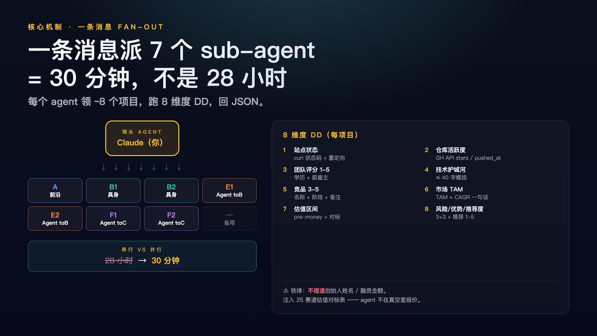
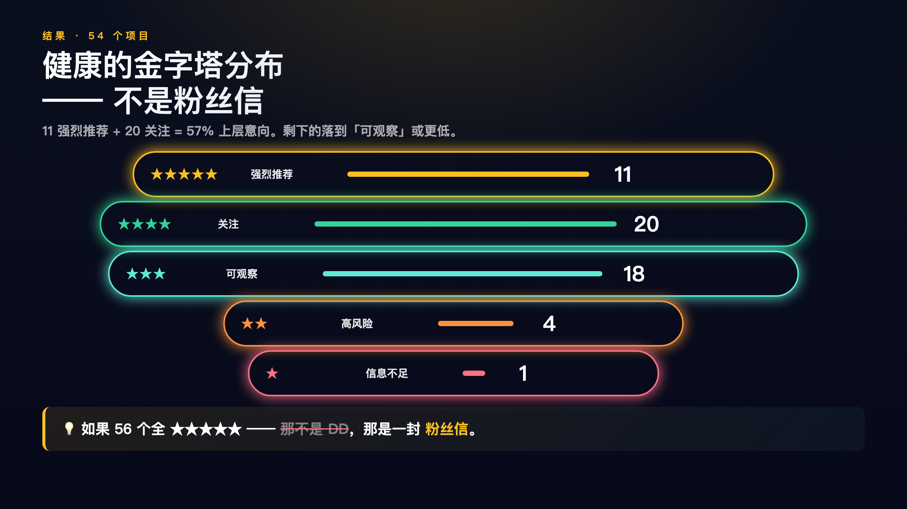

# demo-day-dossier

[](https://qiji-roadshow-2026.pages.dev/)

> 把加速器 / Demo Day 的素材一次跑完，产出一份可发布、可查询、达到投资级别的项目卷宗。

这是一个 Claude Code Skill + 首跑案例的合集仓库：
- 📦 [`skills/demo-day-dossier/`](./skills/demo-day-dossier/) —— 通用流水线（Claude Code Skill 形式，5 阶段端到端编排）
- 🎬 [`examples/`](./examples/) —— 标准数据集示例（首跑：奇绩 2026 春，56 个项目）
- 📊 [`output/`](./output/) —— 首跑案例真实产出（HTML / JSON / CSV / Word）

🌐 **首跑线上版**：
- 全景页：<https://qiji-roadshow-2026.pages.dev/>
- DD 表：<https://qiji-roadshow-2026.pages.dev/dd>
- 📝 实战记（怎么做的）：<https://qiji-roadshow-2026.pages.dev/story> · [markdown 原文](./docs/story.md)
- 📰 **微信公众号推文版**：<https://mp.weixin.qq.com/s/oqPryhI-V3VOOmmoo-hFYg>（2026-06-08 发布于「张路的碎碎念」）
- 📕 **小红书图文笔记版**：<https://www.xiaohongshu.com/discovery/item/6a2601120000000022009de4>（2026-06-08 发布于「林雷」，19 字标题 + 695 字正文 + 5 张 3:4 竖图）
- 🐦 **X 中文 thread 版**：<https://x.com/zhanglu/status/2063789867855974665>（2026-06-08 发布于 [@zhanglu](https://x.com/zhanglu)，10 条 thread + 4 张 16:9 配图，**浏览器兜底**发布 —— X API Free tier 已废）

### X 中文 thread 配图预览

<table>
<tr>
<td width="50%"><a href="https://x.com/zhanglu/status/2063789867855974665"></a><br/><sub><b>Tweet 1 · hook</b> — 一晚 DD 完 56 个奇绩项目</sub></td>
<td width="50%"><a href="https://x.com/zhanglu/status/2063789867855974665"></a><br/><sub><b>Tweet 5 · pipeline</b> — 一条消息派 7 个 sub-agent</sub></td>
</tr>
<tr>
<td width="50%"><a href="https://x.com/zhanglu/status/2063789867855974665"></a><br/><sub><b>Tweet 8 · data</b> — 54 项目推荐度金字塔</sub></td>
<td width="50%"><a href="https://x.com/zhanglu/status/2063789867855974665"></a><br/><sub><b>Tweet 10 · CTA</b> — 开源 skill + 线上链接</sub></td>
</tr>
</table>

> 详细发布复盘见 [`skills/x-publish/examples/demo-day-dossier-2026-zh/README.md`](./skills/x-publish/examples/demo-day-dossier-2026-zh/README.md) —— 含 X 加权字数、字体陷阱、Free tier 402 实测、兜底流程实际耗时。

---

## 它能做什么

给定一个工作目录（项目卡截图 + 展区现场照 + 一篇官方文章 URL + 可选会议纪要），跑完 5 阶段流水线 + 可选 wiki 扩展层，自动产出：

| # | 资产 | 说明 |
|---|------|------|
| 1 | `projects.json` | 全部项目的规范化结构数据集（含 live_pitch / card_team / booth_no 等富字段） |
| 2 | `index.html` | 全景式可交互落地页（4 色分区 Tab、TOP 推荐徽章、创始人金框、🎤 现场 pitch 高亮、🔍 项目卡 OCR 可展开） |
| 3 | `dd_data.json` + `dd.html` | 7 路并行调研 agent 产出的 8 维度 DD 表（可排序 / 可筛选 / 抽屉详情） |
| 4 | `路演项目全景调研报告_vN.0.docx` | 全景 Word 深度报告 |
| 5 | `路演项目尽职调查报告_vN.0.docx` | DD Word 深度报告 |
| 6 | `DD_table.csv` | Excel / Numbers 可打开的扁平表 |
| 7 | **`output/wiki/`** | 互链 HTML 知识库（人物 / 概念 / 实体 / 纪要四维度，客户端搜索，从 `projects.json` 自动派生） |
| 8 | Cloudflare Pages 部署 | 一键发布全景页 + DD 表 + Wiki |

---

## 5 阶段流水线

```
[阶段 0] 盘点素材：找到展区墙 + 官方文章 + 按项目卡片
       ↓
[阶段 1] 抽取结构化数据：图片 → 项目 JSON（与官方文章交叉对照命名）
       ↓
[阶段 2] 全景落地页 + 首份 Word 报告
       ↓
[阶段 3] 启动 7 个并行 DD 调研 agent（8 维度框架，30 分钟内并行完成）
       ↓
[阶段 4] DD 表页面 + DD Word 报告 + CSV
       ↓
[阶段 5] 部署到 Cloudflare Pages
```

详细执行细节、Prompt 模板、估值参考表见 [`skills/demo-day-dossier/SKILL.md`](./skills/demo-day-dossier/SKILL.md)。

**v6.0 新增**: wiki 互链知识库 + 自动同步机制,详见 [`docs/wiki-and-sync.md`](./docs/wiki-and-sync.md)。

---

## 8 维度 DD 框架

每个 agent 对每个项目自动填写：

| # | 维度 | 验证方式 |
|---|------|---------|
| 1 | 站点状态 | `curl -sI -L --max-time 8 <url>` 拿 HTTP 码 + 重定向 |
| 2 | Repo 活跃度 | `curl https://api.github.com/repos/<owner>/<repo>` 拿 stars / pushed_at |
| 3 | 团队评分 (1-5) | 学历 + 前雇主 + 经验深度综合 |
| 4 | 技术护城河 | ≤40 字一句话 |
| 5 | 竞品 (3-5 个) | `[{name, stage, note}]`，WebSearch 核实融资轮次 |
| 6 | 市场 TAM | TAM + CAGR 一句话 |
| 7 | 估值区间 | Pre-money USD 区间 + 对标依据（参考 [`valuation_hints.md`](./skills/demo-day-dossier/templates/valuation_hints.md)） |
| 8 | 风险 / 优势 (各 3) + 推荐度 (1-5) + 一句话判断 | DD 结论 |

---

## 仓库结构

```
.
├── README.md                                ← 当前文件
├── LICENSE                                  ← MIT
├── skills/                                  ← 仓库自带的四个 Claude Code Skill
│   ├── demo-day-dossier/                   ← Skill 1：路演项目卷宗流水线
│   │   ├── SKILL.md                        ← 5 阶段流水线 SOP
│   │   ├── README.md
│   │   ├── templates/                      ← HTML 模板 + DD agent prompt + 估值对标
│   │   └── scripts/                        ← build_panoramic/dd_html/dd_csv/dd_report/deploy
│   ├── wechat-article-publish/             ← Skill 2：项目到公众号推文的半自动管道
│   │   ├── SKILL.md                        ← 5 阶段 SOP（写文 / 配图 / 转 HTML / 贴 / 发）
│   │   ├── README.md
│   │   ├── templates/                      ← article.md + 4 个插图 HTML 模板（16:9）
│   │   ├── scripts/                        ← md2wechat / wechat_publish / render-image
│   │   │                                     / set-clipboard-html / send-cmd-v
│   │   └── examples/demo-day-dossier-2026/ ← 首跑案例：实战记 4200 字
│   ├── xiaohongshu-publish/                ← Skill 3：长文到小红书图文笔记的半自动管道
│   │   ├── SKILL.md                        ← 4 阶段 SOP（改写 / 5 张竖图 / 贴 / 人工发）
│   │   ├── README.md
│   │   ├── templates/                      ← post.md + 5 个 3:4 竖屏插图模板
│   │   ├── scripts/                        ← md2xhs / xhs_publish / set-clipboard-text
│   │   │                                     ＋ symlink 复用 wechat 的 render-image/send-cmd-v
│   │   └── examples/demo-day-dossier-2026/ ← 首跑案例：xhs 笔记 19 字标题 + 5 图
│   └── x-publish/                          ← Skill 4：长文到 X 英文 thread 的全自动管道（API）
│       ├── SKILL.md                        ← 4 阶段 SOP（thread / 4 张 16:9 / API 发 / 验证）
│       ├── README.md
│       ├── templates/                      ← thread.md + 4 张 16:9 模板（cover/pipeline/stat/cta）
│       ├── scripts/                        ← md2thread / post_thread_api (tweepy)
│       │                                     / post_thread_browser / verify_thread
│       └── examples/
│           ├── demo-day-dossier-2026/      ← 首跑案例：10 条英文 thread + 4 图（API 路径）
│           └── demo-day-dossier-2026-zh/   ← 中文首发案例：10 条中文 thread + 4 张中文图（浏览器兜底）
├── examples/                                ← demo-day-dossier 的参考数据集
│   ├── projects.qiji-2026.json
│   └── dd_data.qiji-2026.json
├── docs/                                    ← 项目文档
│   ├── story.md                            ← 公众号实战记 markdown 源
│   ├── wechat-images.md                    ← 配图清单 + 排版指南
│   ├── wechat-publish.md                   ← 发文流程速查
│   └── images/                             ← 7 张配图（CF Pages 公开访问）
├── output/                                  ← 首跑案例真实产出（CF Pages 部署根）
│   ├── index.html                          ← 全景页（projects.json 内嵌）
│   ├── dd.html                             ← DD 表
│   ├── story.html                          ← 实战记网页版
│   ├── images/                             ← 镜像 7 张配图（被 wechat 编辑器拉走）
│   ├── projects.json / dd_data.json / DD_table.csv
│   ├── docs/*.docx                         ← Word 深度报告
│   └── wiki/                               ← v6.0 新增：互链知识库
│       ├── index.html / meetings/ / people/ / concepts/ / entities/
│       ├── sources/*.md                    ← 5 份会议纪要原文（去飞书链接）
│       ├── assets/styles.css + search.js   ← 客户端搜索
│       └── data/
│           ├── extracted.json              ← 合并后数据
│           ├── search-index.json
│           └── raw/batch-1..4.json         ← 4 批数据源（1=纪要 / 2=OCR / 3=调研 / 4=auto-derived）
├── scripts/                                 ← v6.0 新增：站点 ↔ wiki 同步工具
│   ├── sync-wiki.py                        ← 一键入口：projects.json → batch-4 → merge → render → 内嵌
│   ├── projects_to_batch4.py               ← 54 项目 + 创始人 → wiki entity/person 转换器
│   └── _lib/{fix_json,merge,render}.py     ← 复用自 ~/.claude/skills/notes-wiki
├── Makefile                                 ← sync / serve / check / clean
└── .github/workflows/sync-check.yml         ← CI 守护：跑 sync 后 git diff, 不一致则 fail PR
```

---

## 安装与使用

### 1. 当作 Claude Code Skill 使用（推荐）

本仓库自带 **四个** skill，分别拷贝到 Claude Code 的 skills 目录：

```bash
# 路演项目卷宗流水线
cp -r skills/demo-day-dossier ~/.claude/skills/demo-day-dossier

# 项目到公众号推文的半自动管道
cp -r skills/wechat-article-publish ~/.claude/skills/wechat-article-publish

# 长文到小红书图文笔记的半自动管道
cp -r skills/xiaohongshu-publish ~/.claude/skills/xiaohongshu-publish

# 长文到 X 英文 thread 的全自动管道（API）
cp -r skills/x-publish ~/.claude/skills/x-publish
```

之后在 Claude Code 里直接调用：

```
/demo-day-dossier ~/Downloads/yc-demo-day-w26 https://www.ycombinator.com/blog/yc-winter-2026-batch
/wechat-article-publish ~/dev/my-finished-project
/xiaohongshu-publish ~/dev/my-finished-project/docs/story.md
/x-publish ~/dev/my-finished-project/docs/story.md
```

| Skill | 任务 | 自动化 |
|-------|------|--------|
| [`demo-day-dossier`](./skills/demo-day-dossier/SKILL.md) | 路演素材 → 全景页 + DD 表 + Word 报告 + 部署 | 全自动 |
| [`wechat-article-publish`](./skills/wechat-article-publish/SKILL.md) | 项目 → 公众号长文 + 7 张 16:9 配图 + 半自动贴 | 半自动（个人号无 API）|
| [`xiaohongshu-publish`](./skills/xiaohongshu-publish/SKILL.md) | 长文 → 小红书 3 段式 + 5 张 3:4 竖图 + 半自动贴 | 半自动（个人号无 API）|
| [`x-publish`](./skills/x-publish/SKILL.md) | 长文 → X thread + 4 张 16:9 配图 + 发布 | API 全自动 + 浏览器兜底 双路径 ⚠️ |

> ⚠️ X API Free tier 实测已废（2026-06-08 验证：v1.1 `media/upload` 和 v2 `tweets` 全部返回 402 CreditsDepleted）。Basic tier $200/月起。**0 元用户走浏览器兜底**（`post_thread_browser.py`，~5 分钟手动 chain 10 条）。详见 [`skills/x-publish/examples/demo-day-dossier-2026-zh/README.md`](./skills/x-publish/examples/demo-day-dossier-2026-zh/README.md)。

**一次写作，多平台分发** —— 同源内容 + 平台特化改写：
- 公众号：4200 字中文叙事 + 7 张 16:9
- 小红书：695 字中文 emoji 化 + 5 张 3:4 + 6 hashtag
- **X 英文**：10 条英文 thread + 4 张 16:9（API 全自动 8 秒发完，需 Basic tier）
- **X 中文**：10 条中文 thread + 4 张中文 16:9（浏览器兜底 ~5 分钟，0 元；中文加权 280 ≈ 140 字）

### 2. 手动跑脚本

```bash
# 准备工作目录
mkdir -p ~/myrun/output
# 把 projects.json 放进 ~/myrun/output/

# 阶段 2：全景落地页
python3 skills/demo-day-dossier/scripts/build_panoramic.py ~/myrun

# 你需要自己启动 7 个 DD agent（或一个一个调），把它们的输出合并为 dd_data.json

# 阶段 4：DD 页 + CSV + markdown 报告
python3 skills/demo-day-dossier/scripts/build_dd_html.py      ~/myrun
python3 skills/demo-day-dossier/scripts/build_dd_csv.py       ~/myrun
python3 skills/demo-day-dossier/scripts/build_dd_report_md.py ~/myrun

# 阶段 5：Word（需 pandoc）
cd ~/myrun/output
pandoc report_v1.md  -o "路演项目全景调研报告_v1.0.docx" --standalone
pandoc dd_report.md  -o "路演项目尽职调查报告_v1.0.docx" --standalone

# 阶段 5：本地直推（仅作首跑实验，正式发布请走 GitHub → CF）
skills/demo-day-dossier/scripts/deploy_cloudflare.sh ~/myrun my-cohort-slug "v1.0 首发"
```

---

## 发布流程：先 GitHub，再 Cloudflare 自动部署

本仓库的标准发布次序固定为 **`git push` → Cloudflare Pages 自动触发部署**。不要再从本地直接 `wrangler pages deploy`。

### 一次性接线（Cloudflare Dashboard）

实际做法是 **直接在既有的 `qiji-roadshow-2026` Pages 项目上挂 Git 集成**，保持线上域名不变（`qiji-roadshow-2026.pages.dev`），首跑历史 deploy 与新 GitHub-source deploy 都在同一个 project 的部署列表里。

1. 打开 **Cloudflare Dashboard → Workers & Pages → `qiji-roadshow-2026` → Settings → Builds & deployments → Connect to Git**。
2. 选 GitHub 账号下的 `zhanglunet/demo-day-dossier` 仓库，授权 CF 读取。
3. 配置：
   - **Production branch**：`main`
   - **Build command**：留空（纯静态站点）
   - **Build output directory**：`output`
   - **Root directory**：留空
4. 保存。首次自动触发 deploy 后，每条 `main` 上的新 commit 都会自动跑一次部署。

> 如果是全新项目，也可以走 **Create → Pages → Connect to Git** 流程新建一个 `demo-day-dossier` project，URL 会是 `demo-day-dossier.pages.dev`。两种做法等价 —— 选哪种取决于你想不想保留旧 URL。

### 此后每次发布

```bash
# 1. 改 projects.json (项目信息变更的唯一入口)
$EDITOR output/projects.json

# 2. 一键同步 wiki + index.html / dd.html 的内嵌 JSON
make sync

# 3. push 触发 CF Pages 自动部署
git add -A && git commit -m "..." && git push
```

`make sync` 会跑 `python3 scripts/sync-wiki.py`, 整条链:

```
output/projects.json
        ↓ scripts/projects_to_batch4.py  (54 项目 → entity + 创始人 → person)
output/wiki/data/raw/batch-4.json
        ↓ scripts/_lib/fix_json.py       (idempotent JSON 修复)
        ↓ scripts/_lib/merge.py          (合并 batch-1/2/3/4 → extracted.json)
        ↓ scripts/_lib/render.py         (渲染所有 wiki HTML)
output/wiki/**/*.html  +  data/extracted.json  +  data/search-index.json
        ↓ 重新内嵌 projects.json 到 index.html / dd.html
done
```

batch-1/2/3 (会议纪要 / OCR / 调研) 是一次性产出, 不被 sync 触碰; 只有 batch-4 (项目+创始人) 从 projects.json 派生。

### CI 守护

`.github/workflows/sync-check.yml` 在 PR + push 时自动跑 `make check`:
- 跑 `sync-wiki.py`
- 跑 `git status --porcelain output/`, 若有变化则 fail
- 防止「改了 projects.json 但忘了 `make sync`」

无需 GitHub Secret、无需 `wrangler login` —— CF Pages 原生 Git 集成自动 build & deploy。

### 部署验证（可选）

```bash
# 看最近 deployment 的 Source 是否匹配最新 commit SHA
npx wrangler pages deployment list --project-name=qiji-roadshow-2026 | head -8

# 直接 curl 看线上是否反映了改动
curl -s https://qiji-roadshow-2026.pages.dev/README.md | head -5
```

> `skills/demo-day-dossier/scripts/deploy_cloudflare.sh` 仅保留作离线 / 无 GitHub 环境下的应急直推。

---

## 首跑案例：奇绩创坛 2026 春季路演日

> 54 个展示项目(本届录取 74) · 4 大分区 · 1 篇官方微信文章 · 22 张项目卡截图 · 7 个 DD agent · 5 份现场会议纪要 · 360+ 张展厅照片

| 分区 | 主题 | 项目数 |
|------|------|--------|
| A 区 | 前沿科技 | 11 |
| B 区 | 具身智能与硬件 | 19 |
| E 区 | Agent toB | 12 |
| F 区 | Agent toC | 12 |
| **合计** | | **54** |

**Cohort 画像**：本届录取 74 个 / 路演展示 54 个、录取率 1%、Researcher Founder 占比 45%、硕士及以上 62%、海外团队 43%。

**DD 推荐度分布**（54 个项目）：

| 推荐度 | 含义 | 项目数 |
|--------|------|--------|
| ★★★★★ | 强烈推荐 | 11 |
| ★★★★ | 关注 | 20 |
| ★★★ | 可观察 | 18 |
| ★★ | 高风险 | 4 |
| ★ | 信息不足 | 1 |

### v6.0 数据演化时间线

| 版本 | 数据源 | 关键变化 |
|------|--------|---------|
| v3.0 | 22 张项目卡 + 1 篇官方文章 | 首个全景 + DD 表 |
| v4.0 | + 官方文章一手补全 | 命名/创始人交叉对照 |
| v5.0 | + 5 份现场会议纪要 + /notes-wiki 知识库 | 6 项目加入 `live_pitch` 现场原话 |
| **v6.0** | + 364 文件 OCR(项目卡/路演照/Monova/Thennote)+ 35 一手来源调研 + 全 54 项目映射进 wiki | 23 项目补 `card_team`/`booth_no`/`contact`,全 54 项目 entity 化,陆奇 + 6 明星校友 deep bio |

### 4 个线上入口

- 🌐 **全景页** <https://qiji-roadshow-2026.pages.dev/> — 54 项目 + 现场 pitch + 项目卡 OCR 详情
- 🔍 **DD 表** <https://qiji-roadshow-2026.pages.dev/dd> — 8 维度尽职调查表 + drawer 详情
- 📚 **现场纪要 Wiki** <https://qiji-roadshow-2026.pages.dev/wiki/> — **5 纪要 · 69 人物 · 27 概念 · 84 实体** 互链知识库, 全文检索, 飞书原始链接 → 本地 .md
- 📝 **实战记** <https://qiji-roadshow-2026.pages.dev/story> — 怎么用 5 阶段流水线做出来的复盘

---

## 设计原则

- **命名优先级**：官方文章 > 项目卡 > 展区墙 > 旧报告。
- **不编造**：证据不明时写「未公开」「待核实」；wiki 实体描述中对未确认事实显式标注 "投资关系未公开确认"。
- **诚实分布**：DD 推荐度要呈金字塔（rec=5 约 10-20%、rec=4 约 30-40%、其余 rec≤3），不要写成粉丝信。
- **并行才划算**：7 个 DD agent / 5 路 OCR agent 一定要 **一条消息里一次性发** 才并发，不要串行。
- **公开 vs 私有分清**：默认只把 `index.html` / `dd.html` / `wiki/` 推到 CDN；JSON / Word 报告 / 飞书原文 .md 也可上 CDN（本仓库已清理飞书外链）。
- **单一数据源**：`projects.json` 是唯一的项目信息入口；`index.html` / `dd.html` 内嵌 JSON 与 `wiki/data/raw/batch-4.json` 都从它派生。改完跑 `make sync` 即可。
- **手工调优受保护**：batch-1/2/3（纪要 / OCR / 调研）是一次性产出，`make sync` 不会覆盖它们；只有 batch-4 是自动生成。

---

## 依赖

- **Python 3.9+**（脚本只用标准库）
- **pandoc**（markdown → docx）
  ```bash
  brew install pandoc          # macOS
  apt install pandoc           # Debian/Ubuntu
  ```
- **wrangler**（部署，可选）
  ```bash
  npm i -g wrangler            # 或用 npx wrangler
  npx wrangler login
  ```
- **Claude Code**（当 skill 用时）

---

## ⚠️ 免责声明 · Disclaimer

> 这一段对应 [线上版同款 disclaimer](https://qiji-roadshow-2026.pages.dev/#disclaimer)，转载请保留全文。

1. **非官方独立项目**。本仓库及部署的站点 `qiji-roadshow-2026.pages.dev` 是 **独立调研整理**，**非奇绩创坛官方**，亦未获得任何参展项目方背书或授权。涉及的项目名称、商标、Logo 归原权利人所有。

2. **信息来源透明**。全部内容基于公开渠道——项目卡 / 路演现场照片 / 微信公众号 / 财经媒体 / 招股书 / 官方网站等——以及 AI 辅助 OCR、结构化抽取与多源交叉验证产出。每个 wiki entity 描述中已标注信息源与置信度（如 "投资关系未公开确认"）。

3. **不构成投资建议**。8 维度 DD 评分、估值区间、推荐度、TAM 估算均为 **基于公开信息的二手分析**，仅供研究学习参考。**不构成任何形式的投资建议**。投资决策应以企业官方披露和独立尽调为准。

4. **时效性提示**。数据截至 **2026-06-08**，部分信息可能已过期；具体融资进度、估值、产品发布状态请以企业官方披露为准。AI 抽取过程可能存在 OCR 误读或语义偏差，发现错误请提 [GitHub Issue](https://github.com/zhanglunet/demo-day-dossier/issues)。

5. **隐私与肖像**。路演现场照片 / 项目卡仅用于场景记录与项目识别。如果您是项目方或现场嘉宾，认为本站使用了不希望公开的图像 / 信息，请通过 [GitHub Issue](https://github.com/zhanglunet/demo-day-dossier/issues) 联系作者，48 小时内审核处理。

6. **第三方品牌**。文中提及的 Y Combinator、奇绩创坛、月之暗面、百川智能、智元、帕西尼、斯坦德、基流以及其他公司名称、产品名称、Logo 仅为客观描述用途，归各自权利人所有。

7. **代码与方法论**。本仓库的 Skill / 脚本 / 流水线本身 (`skills/` / `scripts/`) 以 [MIT 许可](./LICENSE) 开放，可自由复用到您自己的 demo day / accelerator batch；案例数据 (`output/` 中的 `projects.json` 等具体调研产出) 是首跑案例参考，复用时请重新执行流水线而非直接搬运。

---

## 许可

MIT — 见 [LICENSE](./LICENSE)。

数据声明：`output/` 与 `examples/` 中的 DD 评估、估值区间、推荐度仅作研究参考，**不构成投资建议**。完整免责声明见上节。
