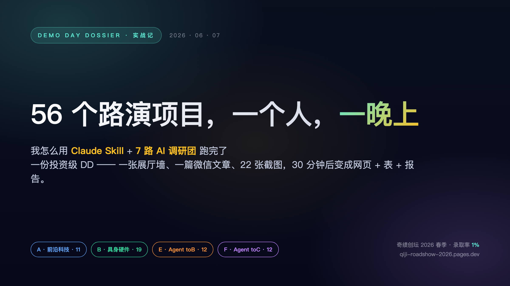
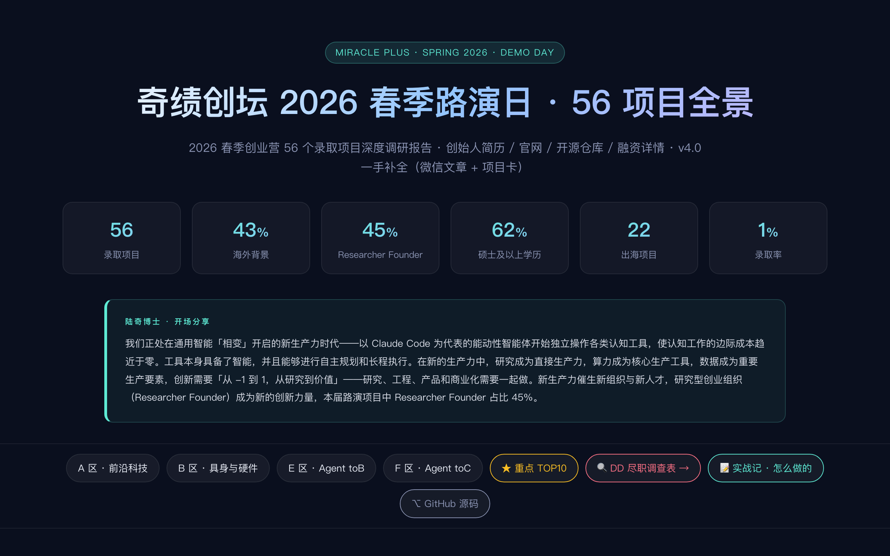
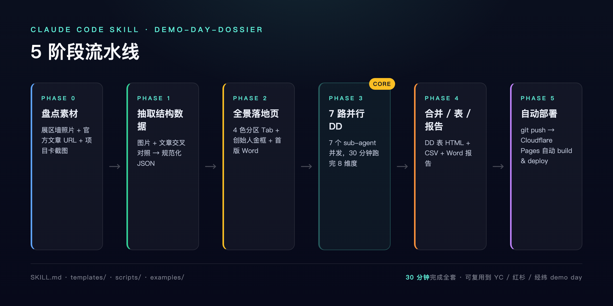
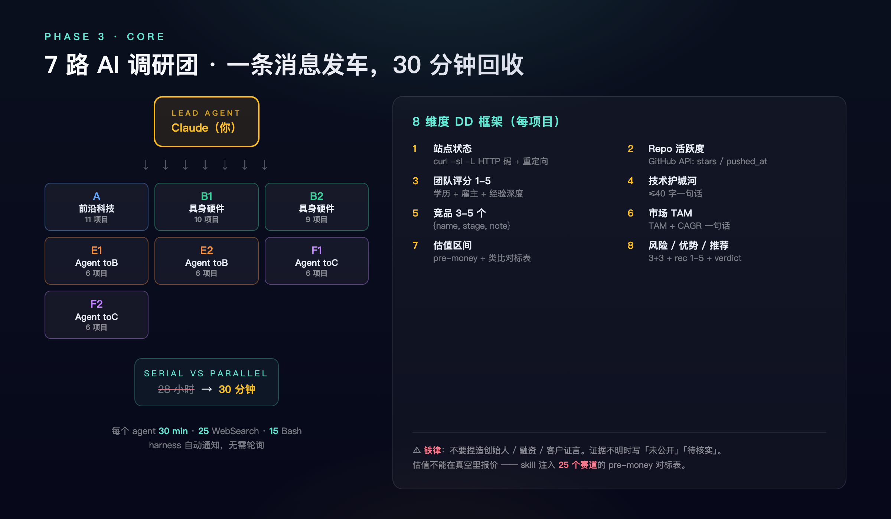
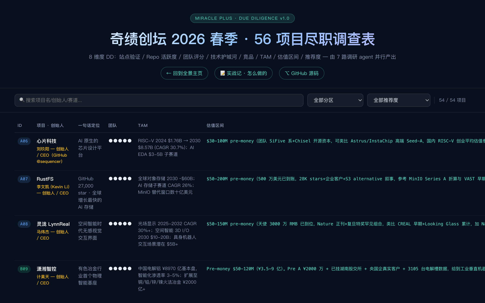
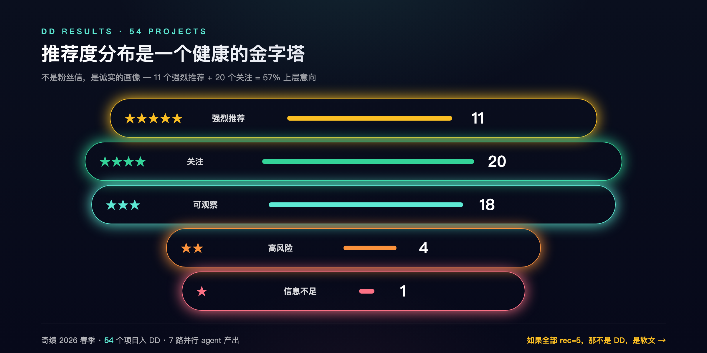
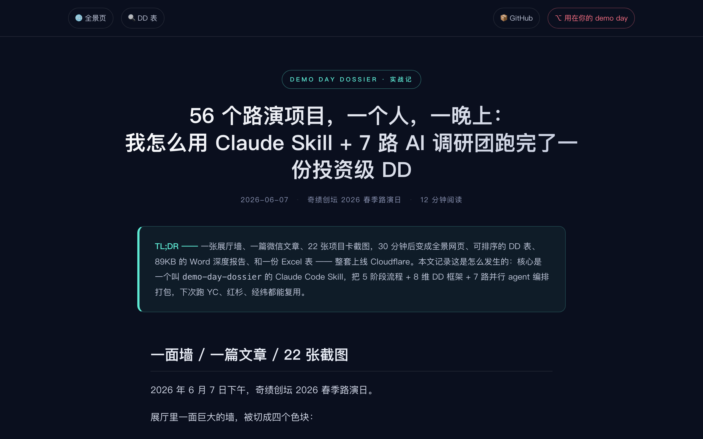

# 公众号配图清单 — 一图一位

> 7 张图，发公众号时按下表对号入座。所有图都是 2400×1350（或对应宽高）@2x Retina，PNG 直传，无需缩放。

图源在 [`docs/images/`](./images/)。生成器源码在 [`docs/images/_makers/`](./images/_makers/)，改文案后可重跑 `chrome --headless --screenshot` 重新生成。

---

## 图 ① 封面图 · `00-cover.png`



**用途**：公众号**封面图** + 文章顶部第一屏插图。
**尺寸**：2400×1350（16:9）@2x。
**位置**：标题之后、TL;DR 之前。

---

## 图 ② 全景页 hero · `04-panoramic.png`



**用途**：呼应"一面墙 / 一篇文章 / 22 张截图"段落。是最终产出 1 号。
**尺寸**：2560×1600 @2x（来自线上 `qiji-roadshow-2026.pages.dev/` 顶部）。
**位置**：开篇"一面墙"段落配图，或第二段"56 个项目摆在面前"那里。
**alt 文字建议**：「奇绩 2026 春季 56 项目全景页 · 6 个统计 + 4 色分区 Tab + 陆奇博士开场分享」。

---

## 图 ③ Skill 5 阶段流水线 · `02-pipeline.png`



**用途**：解释整个 skill 的结构骨架。
**尺寸**：2400×1200 @2x。
**位置**：在"Skill 不是 prompt 模板，是 AI 的 SOP"之后，进入 Phase 0 之前。把 5 个阶段一次性铺给读者，后面分节展开。
**alt 文字建议**：「demo-day-dossier skill 的 5 阶段流水线，Phase 3 是 7 路并行 DD 调研团 (CORE)」。

---

## 图 ④ 7 路并行 DD · `03-parallel.png`



**用途**：解释 Phase 3 的核心 —— 1 Lead + 7 个 sub-agent 并发跑 8 维度 DD。
**尺寸**：2400×1400 @2x。
**位置**：在"PHASE 3 · 7 路 AI 调研团出发"小节标题之后、"调度"小节之前。
**alt 文字建议**：「Lead Claude 一条消息发 7 个 sub-agent，串行 28 小时变并行 30 分钟，每个 agent 跑 8 维度 DD」。

---

## 图 ⑤ DD 表线上版 · `05-dd.png`



**用途**：呼应 Phase 4 产出。
**尺寸**：2560×1600 @2x（来自线上 `/dd`）。
**位置**：Phase 4 「合并 + DD 表 + Word + CSV」段落配图。
**alt 文字建议**：「54 个项目的 8 维度 DD 表，可排序 / 可筛选 / 行点开抽屉详情」。

---

## 图 ⑥ 推荐度金字塔 · `06-pyramid.png`



**用途**：把 54 个项目的推荐度分布可视化。重点：**这是一个健康的金字塔，不是粉丝信**。
**尺寸**：2400×1200 @2x。
**位置**：Phase 4 紧接着「54 个项目（剩下 2 个信息不足未入 DD）的推荐度分布最终是」表格之后。
**alt 文字建议**：「DD 推荐度分布：强烈推荐 11、关注 20、可观察 18、高风险 4、信息不足 1」。

---

## 图 ⑦ 实战记网页版 · `07-story.png`



**用途**：作为文末「现在就看 / 试一试」CTA 的配图。或者，作为整篇推文的最后一张，留下「线上版可读」的印象。
**尺寸**：2560×1600 @2x（来自线上 `/story`）。
**位置**：结尾 CTA 之前，或微信文末附录区。
**alt 文字建议**：「本文实战记的网页版，可在 qiji-roadshow-2026.pages.dev/story 阅读」。

---

## 公众号编辑器使用建议

1. **封面图直接拖 `00-cover.png`** 到「上传封面图」位置，比例 16:9 完美适配。
2. **正文里所有图都左右各加 12px 间距**，正文不要顶到边。
3. **图下方加灰色 12px caption**，引用文章原句作为图说，比例最佳。
4. **公众号图片限制**：单张 ≤ 5MB（最大一张 982KB，完全没问题），格式 PNG/JPEG 都可。
5. **加水印**：右上角加「ID @ 你的公众号 ID」，避免被未授权转载。

---

## 推荐排版次序

```
[封面图 00-cover.png]
标题
TL;DR

## 一面墙 / 一篇文章 / 22 张截图
正文...
[图 04-panoramic.png]   ← "56 个项目摆在面前"
正文...

## 这件事，本质上是一个调度问题
正文...

## Skill 不是 prompt 模板，是 AI 的 SOP
正文...
[图 02-pipeline.png]    ← 5 阶段流水线

## Phase 0/1/2 分别展开
正文...

## Phase 3 · 7 路 AI 调研团出发
[图 03-parallel.png]    ← 立刻接上并行架构图
正文 (调度 + 发车 + 等待 + 回收)

## DD 8 维度框架
正文...

## Phase 4 · 合并 / 表 / 报告
正文...
[图 05-dd.png]          ← DD 表线上版截图
正文 (推荐度金字塔表格)
[图 06-pyramid.png]     ← 紧接表格之后的可视化

## Phase 5 · 自动部署
正文...

## 意义
正文...

## 下一次 demo day，你不必再蹲展区
正文...
[图 07-story.png]       ← 文末导流到线上实战记

🔗 链接
```

---

## 重新生成（可选）

如果想改图（比如调文案、换数据），生成器 HTML 在 [`docs/images/_makers/`](./images/_makers/)，重新跑：

```bash
CHROME="/Applications/Google Chrome.app/Contents/MacOS/Google Chrome"
IMG="docs/images"
MAKE="docs/images/_makers"

"$CHROME" --headless=new --disable-gpu --hide-scrollbars \
  --window-size=1200,675 --force-device-scale-factor=2 \
  --screenshot="$IMG/00-cover.png" \
  "file://$PWD/$MAKE/00-cover.html"

# 同理 02-pipeline (1200×600)、03-parallel (1200×700)、06-pyramid (1200×600)
```

线上页面截图：

```bash
"$CHROME" --headless=new --disable-gpu --hide-scrollbars \
  --window-size=1280,800 --force-device-scale-factor=2 \
  --screenshot="$IMG/04-panoramic.png" \
  "https://qiji-roadshow-2026.pages.dev/"
```

---

*这份说明本身就是公众号编辑器外的辅助文档，不进推文。*
